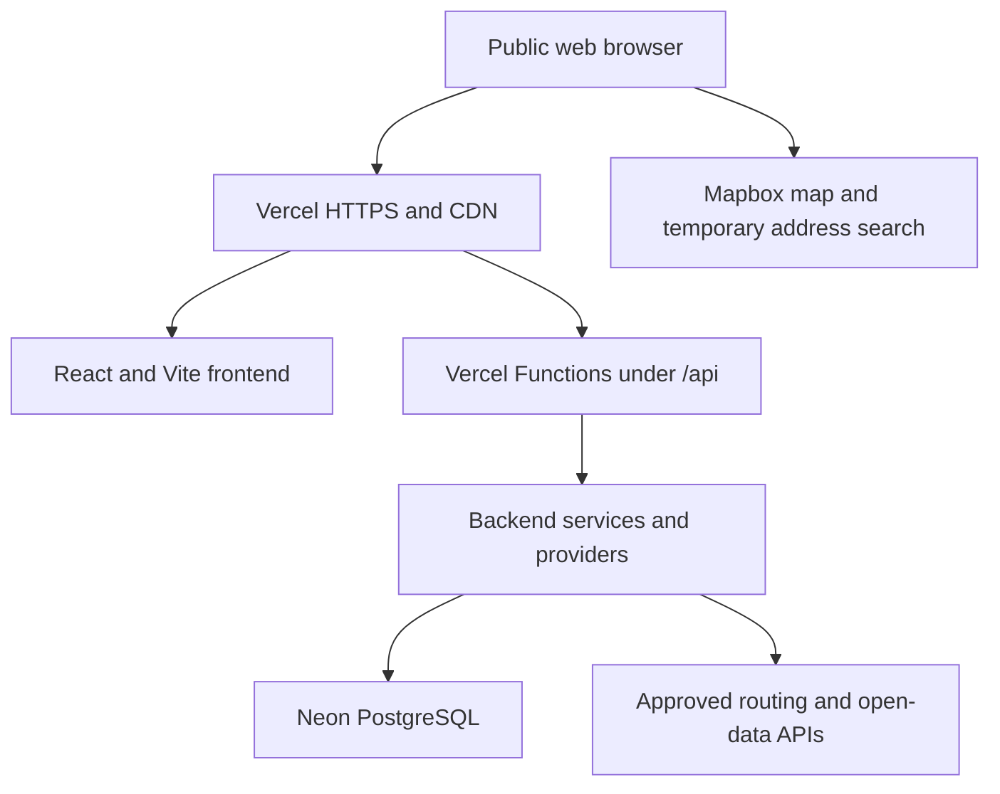

# CalmPath Melbourne

CalmPath Melbourne is a public, no-login web prototype that helps adults compare walking routes through Melbourne CBD using pedestrian crowd information and nearby lower-stimulation public spaces.

The application does not collect user accounts, personal information or journey histories. User preferences are used only for the current request and are not stored.

The project supports UN Sustainable Development Goal 11.

## Current delivery status

The application is publicly deployed at:

<https://calmpath-melbourne.vercel.app>

The current platform deployment is operational:

- the React and Vite frontend is hosted on Vercel;
- `/api/*` requests are handled by Vercel Functions;
- Functions run in the Sydney region (`syd1`);
- Neon PostgreSQL stores cleaned relational open data;
- Vercel connects to Neon using the read-only `calmpath_app` role;
- `/api/health` confirms the API runtime;
- `/api/db-health` confirms database connectivity.

The `/api/routes` flow supports live Mapbox walking routes and the official City of Melbourne rolling past-hour pedestrian feed. Neon, packaged snapshots and deterministic mocks are ordered fallbacks, and every response reports the source mode actually used.

> Source status must always be reported truthfully. Mock, simulated, historical and live data must not be presented as equivalent.

## Product scope

The current project focuses on:

- comparing walking route alternatives;
- entering flexible origins and Melbourne CBD destinations, with optional browser location;
- calculating explainable pedestrian crowd scores;
- allowing users to select a crowd-tolerance preference;
- identifying nearby libraries, parks and public spaces that may offer a lower-stimulation pause;
- displaying the source, confidence and freshness of available data.

The following are not part of the current delivery scope:

- user registration or login;
- collection of personal information;
- storage of user journeys or preferences;
- AI-powered sensory navigation;
- next-hour crowd prediction;
- claims that a public place is guaranteed to be quiet.

The backend produces current crowd alerts only. It does not generate next-hour predictions.

## Repository structure

```text
.
├── code/
│   ├── api/                         # Vercel Function entry points
│   │   ├── health.ts
│   │   ├── db-health.ts
│   │   └── routes.ts
│   ├── frontend/                    # React, TypeScript and Vite web application
│   ├── backend/                     # API services, ports and provider adapters
│   │   └── src/
│   │       ├── adapters/            # Mock, Neon and future live providers
│   │       ├── ports/               # Provider interfaces
│   │       ├── services/            # Route orchestration and scoring
│   │       ├── application.ts       # Backend composition
│   │       ├── http.ts              # Internal HTTP boundary
│   │       └── vercel.ts            # Vercel request adapter
│   ├── packages/contracts/          # Shared frontend and backend contracts
│   ├── data/                        # Cleaned datasets and versioned data assets
│   ├── database/
│   │   ├── migrations/              # Neon PostgreSQL schema
│   │   └── security/                # Application-role permissions
│   ├── infra/                       # Current deployment guide and legacy template
│   ├── vercel.json                  # Vercel build and region configuration
│   ├── pnpm-workspace.yaml
│   └── package.json
├── documents/                       # Project documents and architecture records
├── CONTRIBUTING.md
└── README.md
```

## Current cloud architecture



Vercel hosts the frontend and API in one project. A separate API Gateway is not required.

The browser uses a URL-restricted public Mapbox token for interactive map rendering and temporary address lookup. Route directions continue to use the separate server-only token through the backend. CalmPath does not persist address-search results or browser-location coordinates.

The backend uses ports and adapters. Business services depend on interfaces rather than directly depending on Vercel, Neon, Mapbox or City of Melbourne response formats.

This allows backend providers to be updated and redeployed without rebuilding the cloud architecture.

## Current API endpoints

| Method | Path | Current purpose |
| --- | --- | --- |
| `GET` | `/api/health` | Confirms that the Vercel API runtime is available |
| `GET` | `/api/db-health` | Confirms that Neon PostgreSQL is reachable |
| `POST` | `/api/routes` | Returns scored route alternatives, current alerts and nearby quiet-space candidates |

`POST /api/routes` reports `LIVE`, `SNAPSHOT`, `MOCK` or `MIXED` according to the providers used for that request. A separate gateway is not required for each internal provider or calculation.

Additional public endpoints should only be introduced when they represent a separate client-facing operation.

## Data architecture

Only cleaned open data and application reference data are stored in the cloud database. The database does not contain user data.

The current Neon schema contains:

| Table | Purpose | Current status |
| --- | --- | --- |
| `pedestrian_sensor` | Sensor identifiers, labels, status and coordinates | Populated with cleaned sensor data |
| `pedestrian_count_hourly` | Historical hourly pedestrian counts | Populated with cleaned historical data |
| `quiet_space_candidate` | Libraries, parks and public-space candidates | Populated with cleaned candidate data |

The historical data supports comparison with normal crowd patterns. When live data is enabled,
near-real-time information comes only from the City of Melbourne rolling past-hour per-minute API
(`pedestrian-counting-system-past-hour-counts-per-minute`) and is not stored in Neon. Neon provides
the hourly historical `SNAPSHOT` fallback. The unused `pedestrian_count_minute` table is removed by
database migration `002_drop_unused_pedestrian_count_minute.sql`.

### Baseline data

`baseline.json` contains historical median and P95 values by sensor, weekday and hour.

It is a versioned backend data asset rather than a relational table. The file is not automatically used by Vercel merely because it exists in the repository. A backend provider must explicitly import or load it before it affects route scoring.

Historical baseline values must not be described as current live counts.

## Local development

### Prerequisites

- Node.js 24.x
- pnpm 11.9.0

From `code/`:

```bash
pnpm install --frozen-lockfile
pnpm dev
```

Open:

<http://localhost:5173>

The Vite development server forwards `/api` requests to the local backend at `http://localhost:3001`.

The default local route flow uses packaged snapshots and deterministic route fallback, so it does not require external credentials.

The suggested CBD locations also work without browser credentials. Custom address search and the interactive map use the URL-restricted `VITE_MAPBOX_TOKEN`. Current location is requested only after the user selects the location button and is not saved by CalmPath.

## Environment variables

Copy variable names from `code/.env.example`. Never commit real values.

Important variables include:

| Variable | Exposure | Purpose |
| --- | --- | --- |
| `DATABASE_URL` | Server only | Pooled Neon connection string for the read-only application role |
| `VITE_API_BASE_URL` | Browser | API base path; normally `/api` |
| `VITE_MAPBOX_TOKEN` | Browser | Optional URL- and scope-restricted token for the map and temporary address search |
| `MAPBOX_SERVER_TOKEN` | Server only | Enables live Mapbox walking-route alternatives |
| `MELBOURNE_OPEN_DATA_BASE_URL` | Server only | Approved City of Melbourne open-data base URL |
| `LIVE_DATA_ENABLED` | Server only | Set to `true` to query current City pedestrian counts |
| `APP_ORIGIN` | Server only | Allowed browser origin for CORS |

Variables without the `VITE_` prefix are not intended for browser code.

`DATABASE_URL` is configured as Sensitive in the Vercel Preview and Production environments.

## Quality checks

From `code/`:

```bash
pnpm check
pnpm dlx vercel@latest build --prod
```

`pnpm check` runs:

- TypeScript checks;
- backend tests;
- frontend tests;
- backend build;
- frontend production build.

Run these checks before merging deployment or application changes.

## Vercel deployment

The Vercel project is configured from `code/vercel.json`.

Current settings:

- framework: Vite;
- install command: `pnpm install --frozen-lockfile`;
- build command: `pnpm --filter @sensory-melbourne/web build`;
- output directory: `frontend/dist`;
- Function region: Sydney (`syd1`).

Create a Preview deployment from `code/`:

```bash
pnpm dlx vercel@latest
```

Deploy to Production:

```bash
pnpm dlx vercel@latest --prod
```

After deployment, verify:

```bash
curl -i https://calmpath-melbourne.vercel.app/api/health
curl -i https://calmpath-melbourne.vercel.app/api/db-health
```

Both endpoints should return HTTP `200`.

The project currently uses manual Vercel CLI deployment. Git-based automatic deployment may be connected later by the team.

## Backend integration handoffs

The remaining business integrations belong to the relevant backend and data owners:

- an approved walking-route provider;
- current or near-real-time pedestrian data;
- matching candidate routes to relevant pedestrian sensors;
- use of historical P95 baseline values;
- Neon repositories for the relational datasets required by route scoring;
- truthful fallback behaviour when a live source is unavailable.

Infrastructure deployment does not need to be redesigned when these providers are completed. The updated backend can be tested in Preview and then redeployed to the same Vercel Production project.

## Security

The public application does not require a firewall or user authentication.

Security controls include:

- HTTPS supplied by Vercel;
- server-side request validation;
- maximum request-body size;
- Melbourne CBD coordinate boundaries;
- Vercel Sensitive environment variables;
- a read-only Neon application role;
- no committed credentials or connection strings;
- no storage of user journeys or preferences;
- no logging of tokens, credentials or precise journey histories;
- truthful labelling of mock, historical, simulated and live data.

The Neon owner role is used only for schema management and controlled data imports. Vercel Functions use the separate `calmpath_app` role with the minimum required permissions.

## Documentation

- [Project overview](documents/project/project-overview.md)
- [System architecture](documents/project/architecture.md)
- [Integration ownership and handoffs](documents/project/integration-guide.md)
- [Requirements traceability](documents/project/requirements-traceability.md)
- [Architecture decisions](documents/project/decisions/README.md)
- [Backend integration guide](code/backend/README.md)
- [Shared contracts guide](code/packages/contracts/README.md)
- [Vercel and Neon deployment guide](code/infra/README.md)
- [Contribution and branch workflow](CONTRIBUTING.md)

## Legacy deployment material

`code/infra/template.yaml` records the original AWS deployment design. It is not used by the current Vercel Production deployment.

The active application does not depend on S3, CloudFront, API Gateway, Lambda, RDS, ACM or CloudFormation.
