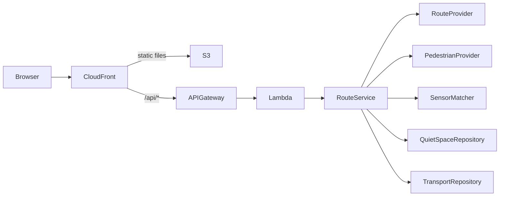

# CalmPath Melbourne

CalmPath Melbourne is a no-login, sensory-aware walking route prototype for adults travelling through Melbourne CBD. It compares walking alternatives using pedestrian-load signals, explains each score, warns when a route exceeds a user's crowd tolerance, and identifies nearby places that may provide a lower-stimulation pause.

The project supports UN Sustainable Development Goal 11. It is currently an integration-ready foundation: the complete user flow runs with deterministic mock providers, while production Mapbox, City of Melbourne, quiet-space, transport and snapshot implementations remain explicit team handoffs.

> The current default composition returns `MOCK` data. Do not describe the application as live until each response reports the actual state of every source through `dataSources`.

## Repository structure

```text
.
├── code/
│   ├── frontend/                 # React, TypeScript and Vite single-page application
│   ├── backend/                  # Lambda-compatible API and integration architecture
│   │   └── src/
│   │       ├── adapters/         # Mock providers and reusable fallback executor
│   │       ├── ports/            # Interfaces for team-owned integrations
│   │       ├── services/         # Route orchestration, scoring and prediction
│   │       ├── application.ts    # Composition root
│   │       └── http.ts           # Validation and HTTP boundary
│   ├── packages/contracts/       # Shared browser/API contracts
│   ├── data/                     # Versioned baseline and snapshot boundaries
│   ├── scripts/                  # Offline preprocessing jobs
│   └── infra/                    # AWS SAM and CloudFormation foundation
└── documents/
    ├── source/                   # Original PDF and DOCX requirement material
    └── project/                  # Architecture, decisions, handoffs and traceability
```

## Architecture at a glance



The backend follows a ports-and-adapters design. `RouteService` depends only on interfaces in `backend/src/ports`; it does not know Mapbox URLs, City of Melbourne payloads or snapshot storage details. The current composition supplies deterministic mock adapters. Team members can implement live or snapshot adapters without editing the orchestration service.

The fallback executor supports the intended order:

```text
LIVE provider -> versioned SNAPSHOT provider -> deterministic MOCK provider
```

Every provider returns source name, mode, timestamp, confidence, staleness and an optional fallback reason. A response may therefore be `MIXED` when different boundaries use different source modes.

## Prerequisites

- Node.js 24 or later
- pnpm 11.9.0 or a compatible pnpm 11 release

## Run locally

```bash
cd code
pnpm install
pnpm dev
```

Open `http://localhost:5173`. Vite forwards `/api` requests to the local backend at `http://localhost:3001`.

No token is required for the default mock flow. To enable only the browser map renderer, copy `code/.env.example` to `code/frontend/.env.local` and add a URL- and scope-restricted `VITE_MAPBOX_TOKEN`. Never commit the resulting environment file.

## API foundation

| Method | Path | Purpose |
| --- | --- | --- |
| `GET` | `/api/health` | Service health |
| `POST` | `/api/routes` | Route comparison, scoring, alerts and nearby resources |
| `GET` | `/api/crowd` | Current crowd boundary for diagnostics |
| `GET` | `/api/quiet-spaces` | Quiet-space repository boundary |
| `GET` | `/api/alerts` | Current and predicted alert boundary |

`POST /api/routes` validates JSON content, payload size, coordinates, Melbourne CBD destination bounds, destination label and crowd threshold. Stable error codes and request IDs are returned to clients.

## Quality checks

```bash
cd code
pnpm check
```

This runs TypeScript checks, automated tests, and production builds for all workspaces. Run it before every pull request.

## Team integration handoffs

The foundation intentionally leaves these implementations to other team members:

- Mapbox geocoding and walking alternatives implementing `RouteProvider`;
- City of Melbourne current and historical pedestrian data implementing `PedestrianProvider`;
- geospatial route-to-sensor matching implementing `SensorMatcher`;
- mentor-approved facility/open-space data implementing `QuietSpaceRepository`;
- Transport Victoria access data implementing `TransportRepository`;
- versioned S3 fallback data implementing `SnapshotRepository`.

Start with [the backend integration guide](code/backend/README.md) and [the project integration guide](documents/project/integration-guide.md). Do not import live provider code directly into `RouteService`; register implementations in `backend/src/application.ts` instead.

## Documentation

- [Project overview](documents/project/project-overview.md)
- [System architecture](documents/project/architecture.md)
- [Integration ownership and handoffs](documents/project/integration-guide.md)
- [Requirements traceability](documents/project/requirements-traceability.md)
- [Architecture decisions](documents/project/decisions/README.md)
- [Backend integration guide](code/backend/README.md)
- [Shared contracts guide](code/packages/contracts/README.md)
- [AWS deployment foundation](code/infra/README.md)
- [Contribution and branch workflow](CONTRIBUTING.md)

## Security and repository hygiene

Dependencies, builds, environment files, coverage output and temporary files are excluded by `.gitignore`. Before pushing, confirm that the repository contains no Mapbox tokens, AWS credentials, `.env` files, `node_modules` or `dist` directories.

Use browser-safe Mapbox tokens only in the frontend. Server tokens belong in the approved AWS secret mechanism. Application logs record request IDs, durations, source modes and error codes, but must not record tokens or precise user journey histories.
