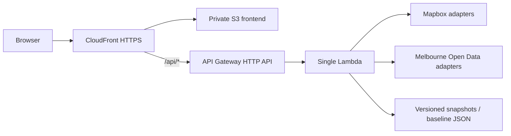

# Sensory-Friendly Melbourne - Architecture

## Outcome

This repository starts as a no-login, public single-page application backed by one serverless API. It is intentionally small enough for a student team to deploy and explain, while preserving clear seams for live data and Mapbox integrations.

## Repository boundaries

- `code/frontend/`: React/Vite SPA. Owns interaction, accessibility, progressive disclosure and map rendering. It never receives a server token.
- `code/backend/`: Lambda-compatible HTTP adapter plus route, scoring and prediction services. External data clients will be added behind this boundary.
- `code/packages/contracts/`: request/response contracts shared by browser and API.
- `code/data/`: small, versioned, non-personal baseline and fallback snapshots.
- `code/scripts/`: offline preprocessing jobs; these do not run during a user route search.
- `code/infra/`: AWS SAM/CloudFormation foundation for the Lambda HTTP API, private S3 bucket, CloudFront OAC and a single public HTTPS entry point.
- `documents/`: original requirements, architecture, traceability and project notes.

## Request flow

1. The browser sends origin, destination and a crowd threshold to `POST /api/routes`.
2. The route service requests walking candidates through a Mapbox adapter (mock candidates in the foundation).
3. A Melbourne data adapter maps current pedestrian sensors to each route and reads a precomputed historical baseline.
4. The scoring service normalizes current count against the sensor's historical P95, aggregates route exposure and assigns LOW, MODERATE or HIGH.
5. The API returns candidate geometry, a transparent explanation, data confidence, alerts and quiet-space candidates.
6. The browser recommends the lowest-load option that satisfies the user's threshold. Colour is never the only indicator.

## Deliberate constraints

- No authentication, user profile or database in the MVP.
- No claim that crowd load represents every sensory factor. Construction and event factors remain disabled until reliable sources are agreed.
- No machine learning for the first prediction. The next-hour boundary uses historical hourly patterns plus a bounded recent trend.
- No live dependency is allowed to make the demo unusable. Adapters must support a timestamped last-known-good snapshot and expose `mode` and data confidence.
- One Lambda is used initially. Internal modules provide separation without operational microservice overhead.

## Integration seams to implement next

1. `MapboxDirectionsClient`: geocoding plus walking alternatives.
2. `MelbournePedestrianClient`: sensor locations, past-hour counts and hourly history.
3. `QuietSpaceRepository`: mentor-approved facilities/open-space source with explicit refuge suitability metadata.
4. `TransportAccessRepository`: Transport Victoria stops near candidate routes.
5. `SnapshotRepository`: S3-backed fallback snapshots with source time and freshness rules.

## Security and operations

- Restrict the browser Mapbox token by allowed URL and scopes.
- Keep server tokens in Lambda environment configuration backed by an AWS secret mechanism; never commit `.env`.
- Keep S3 private and expose it through CloudFront Origin Access Control.
- Log request IDs, upstream latency, adapter mode and error codes, not tokens or precise user journey histories.
- Add CloudWatch alarms for Lambda errors, duration and upstream fallback rate before the public demo.
