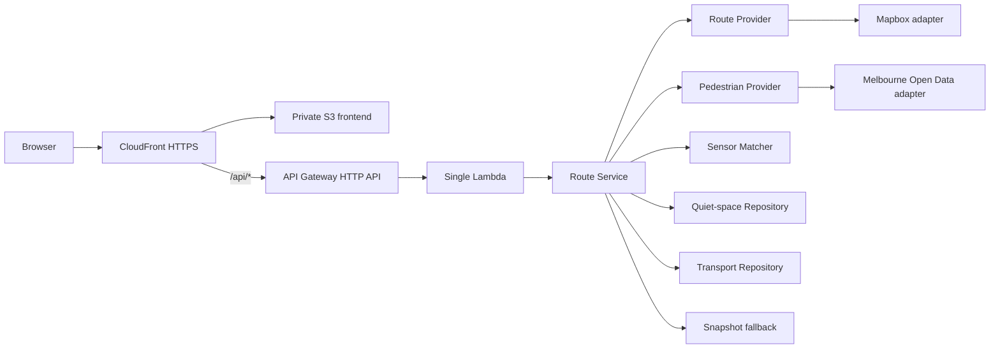

# CalmPath Melbourne system architecture

## Outcome

CalmPath starts as a public, no-login single-page application backed by one serverless API. The topology is deliberately small enough for a student team to deploy and explain, while ports and adapters isolate every external integration.



## Repository boundaries

- `code/frontend/` owns browser interaction, accessibility, progressive disclosure and map rendering. It never receives a server token.
- `code/backend/src/ports/` owns interfaces that external integrations must implement.
- `code/backend/src/adapters/` owns provider-specific transformations. Mock adapters are complete; live and snapshot adapters are team handoffs.
- `code/backend/src/services/` owns orchestration-independent scoring and prediction plus the central route workflow.
- `code/backend/src/application.ts` is the composition root. Provider implementations are registered here, not imported into `RouteService`.
- `code/packages/contracts/` owns public request, response, error and data-source types shared by the browser and API.
- `code/data/` holds small, versioned, non-personal baseline and fallback snapshots.
- `code/scripts/` holds offline preprocessing jobs that do not run during a user search.
- `code/infra/` holds the AWS SAM/CloudFormation foundation.
- `documents/` holds original evidence, architecture decisions, integration guidance and traceability.

## Request flow

1. The browser sends origin, destination, destination label and crowd threshold to `POST /api/routes`.
2. The HTTP boundary validates content type, payload size, coordinates, destination bounds, label and threshold.
3. `RouteService` asks `RouteProvider` for walking candidates.
4. It asks `PedestrianProvider` for current sensor observations.
5. `SensorMatcher` associates observations with each route geometry.
6. The scoring service normalises each current count against historical P95, aggregates route exposure and assigns LOW, MODERATE or HIGH.
7. Quiet-space and transport repositories return resources near the candidate routes.
8. The service generates current alerts and a transparent next-hour prediction boundary.
9. It returns route geometry, explanation, confidence, source status, alerts and nearby resources.
10. The browser recommends the lowest-load option satisfying the user threshold. Colour is never the only indicator.

## Ports and team integration seams

| Port | Responsibility | Pending implementation |
| --- | --- | --- |
| `RouteProvider` | Geocoding and walking alternatives | Mapbox adapter |
| `PedestrianProvider` | Current and historical sensor observations | City of Melbourne adapter |
| `SensorMatcher` | Route-to-sensor geospatial association | Distance/corridor matcher |
| `QuietSpaceRepository` | Mentor-approved lower-stimulation candidates | Facilities/open-space adapter |
| `TransportRepository` | Public transport points near routes | Transport Victoria adapter |
| `SnapshotRepository` | Versioned fallback material | S3 or packaged JSON adapter |

Live adapters must return the shared domain model and source status. Raw third-party payloads must not escape their adapter.

## Source status and fallback

Every provider result includes:

- source name;
- `LIVE`, `SNAPSHOT` or `MOCK` mode;
- source-data timestamp;
- confidence;
- staleness;
- optional fallback reason.

The reusable fallback executor attempts providers in configured order and records previous failures on the successful fallback result:

```text
LIVE -> SNAPSHOT -> MOCK -> UPSTREAM_UNAVAILABLE
```

The overall route response is `MIXED` when boundaries use different modes. A saved or mock result must never be represented as live.

## Scoring boundary

The initial explainable score is:

```text
sensor intensity = clamp(current count / historical P95, 0, 1)
route score = mean(intensity for matched sensors)
```

Initial classification thresholds are:

- LOW below `0.35`;
- MODERATE from `0.35` to below `0.70`;
- HIGH from `0.70`.

These thresholds are architectural defaults, not final validated values. The data owner must calibrate them against real distributions and representative-user feedback. The score currently represents pedestrian pressure only.

## Validation and error boundary

The API provides stable error codes for invalid JSON, invalid content type, oversized payloads, invalid coordinates, destinations outside Melbourne CBD, invalid thresholds, upstream failure, missing routes and unexpected errors. Responses include the request ID when available.

External error messages and tokens must not be returned to clients. Adapters translate third-party failures into application errors or allow the fallback executor to continue.

## Logging and operations

Structured application logs include request ID, endpoint, response status, duration, route and alert counts, source modes, fallback events and stable error codes. They must not include tokens, credentials or precise journey histories.

Before the public demo, add CloudWatch alarms for:

- Lambda errors and duration;
- API 5xx responses;
- provider timeout rate;
- snapshot/mock fallback rate;
- stale data use.

## Deliberate constraints

- No authentication, profile or database in the MVP.
- No claim that pedestrian load represents every sensory factor.
- No construction or event factor until reliable sources are approved.
- No machine learning for the first prediction.
- No live dependency may make the demo unusable.
- One Lambda is used initially; internal modules provide separation without microservice overhead.

## Security

- Restrict browser Mapbox tokens by allowed URL and minimum scopes.
- Store server tokens in the approved AWS secret mechanism; never commit `.env`.
- Keep S3 private and expose it only through CloudFront Origin Access Control.
- Restrict production CORS to the final application origin after the deployment URL is known.
- Retain only operational logs necessary for reliability and acceptance evidence.
