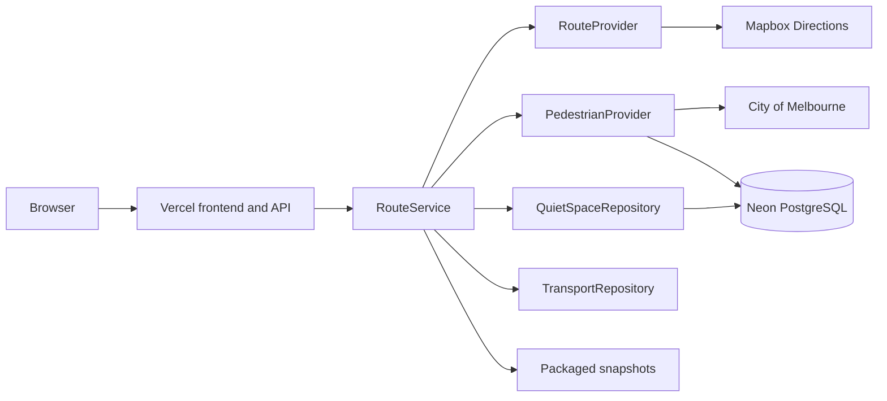

# CalmPath Melbourne system architecture

## Deployed topology

CalmPath is a public, no-login React application deployed with Vercel Functions in Sydney. Neon PostgreSQL stores read-only reference and pedestrian data. Mapbox and City of Melbourne are accessed only through backend adapters; browser code never receives the server token.



## Backend boundaries

- `code/backend/src/ports/` defines integration interfaces.
- `code/backend/src/adapters/` maps third-party and stored data into the shared domain.
- `code/backend/src/services/` owns route scoring and orchestration.
- `code/backend/src/application.ts` is the only composition root.
- `code/packages/contracts/` defines the stable `/api/routes` request and response.
- `code/database/` owns schema, migrations and read-only-role guidance.
- `code/data/` contains non-personal baseline and fallback snapshots.
- `code/api/` contains the Vercel Function entry points.

## Route request flow

1. `POST /api/routes` validates the existing request contract.
2. Mapbox supplies walking alternatives when `MAPBOX_SERVER_TOKEN` is configured.
3. The pedestrian chain tries enabled City live data, Neon data, packaged snapshots and finally mock data.
4. Sensors are matched to route geometry by proximity and normalised against historical P95 values.
5. Neon supplies quiet-space candidates, with packaged and mock fallbacks.
6. The response preserves the existing shape and truthfully labels every source `LIVE`, `SNAPSHOT` or `MOCK`.

Provider order is intentionally resilient:

```text
configured live provider -> Neon/reference data -> packaged snapshot -> mock
```

Missing minute-level rows must never be labelled real time. Hourly Neon observations and packaged files are historical/reference data and retain their actual timestamp and mode.

## Environment and security

- `MAPBOX_SERVER_TOKEN` is server-only and is never logged or exposed to Vite.
- `DATABASE_URL` is read by `@neondatabase/serverless`; no connection string is committed.
- `LIVE_DATA_ENABLED=true` enables the City of Melbourne past-hour adapter.
- `APP_ORIGIN` restricts production CORS to the public application origin.
- The Neon application role is read-only and the product stores no accounts or journey history.

## Current scope boundary

The current handoff excludes turn-by-turn navigation, voice navigation, AI sensory navigation and next-hour prediction. Public-transport access remains behind `TransportRepository` until the responsible teammate supplies an approved dataset and attribution rules. The backend returns an empty, explicitly `MOCK` transport result rather than inventing data.

## Operational acceptance

Pull requests and `main` run `pnpm check` in GitHub Actions. `pnpm smoke:production` checks runtime, database and the route contract; `REQUIRE_LIVE=true pnpm smoke:production` additionally fails when Mapbox is not live or pedestrian data reaches mock fallback.
